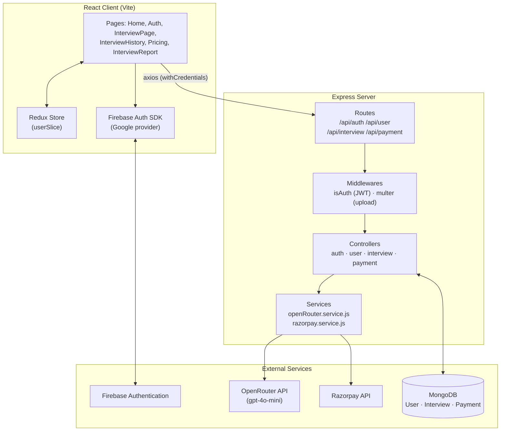
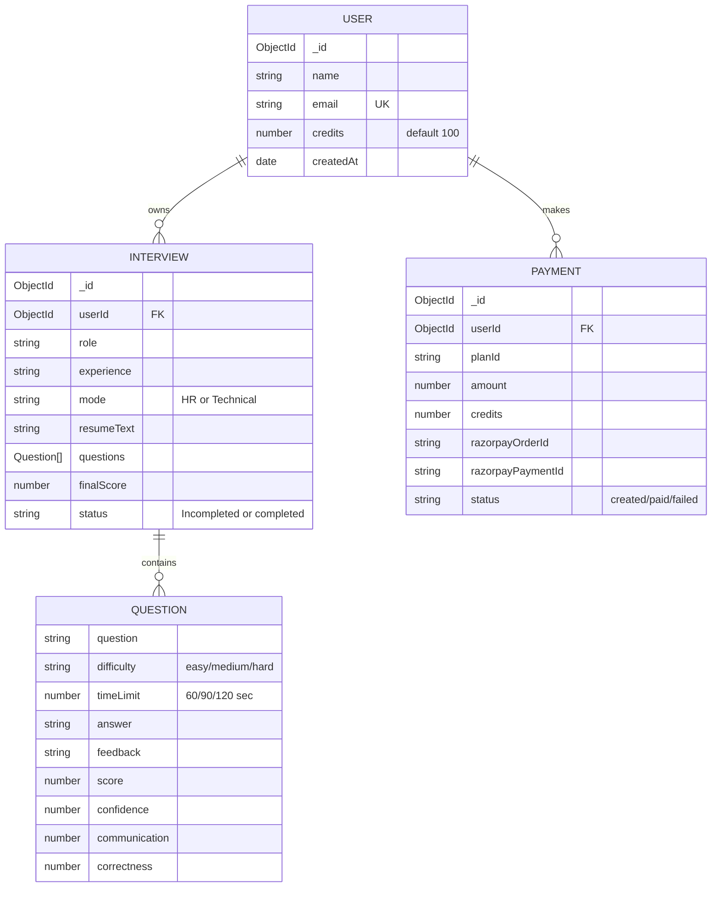
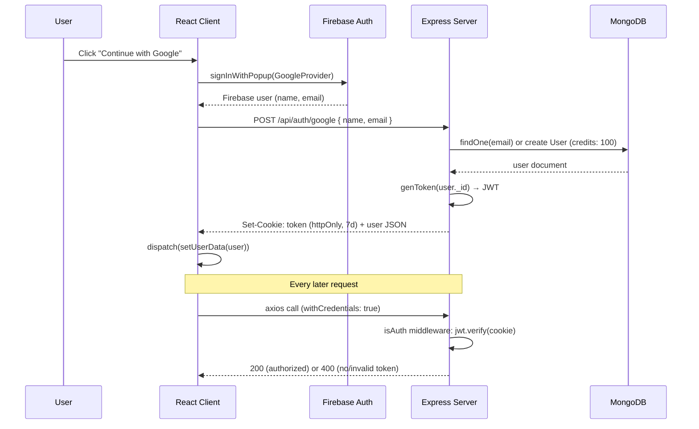
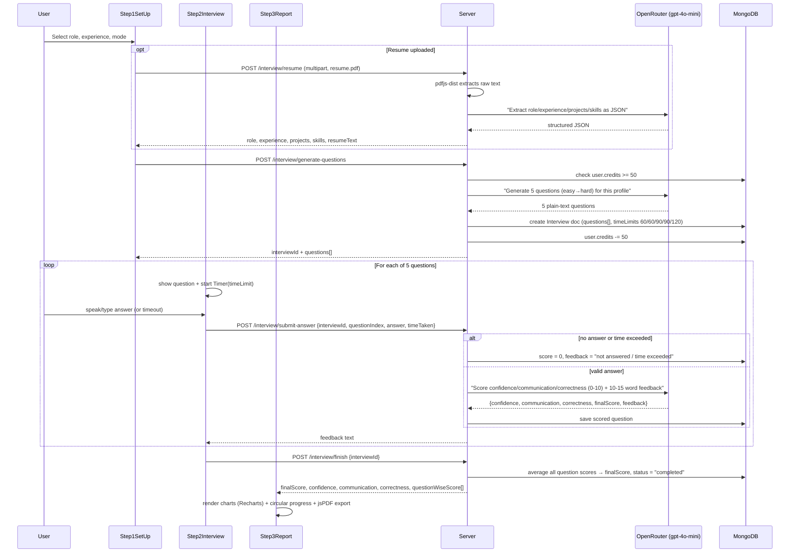
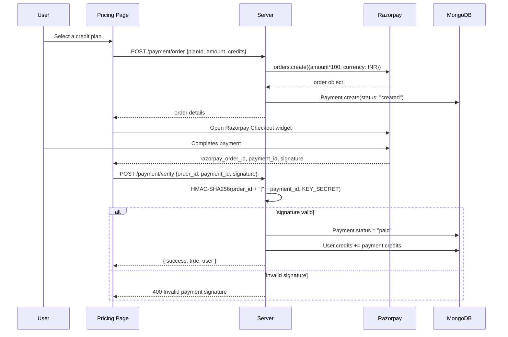

# InterviewIQ.ai — Project Documentation

AI-powered mock interview platform. Users pick a role, experience level, and interview mode (HR / Technical), optionally upload a resume, and go through a timed 5-question AI-generated interview. Each answer is scored live by an LLM across confidence, communication, and correctness, and a final report is generated at the end. A credit-based system (topped up via Razorpay) gates how many interviews a user can run.

---

## 1. Tech Stack

| Layer | Technology |
|---|---|
| Frontend | React 19, Redux Toolkit, React Router v7, Tailwind CSS v4, Framer Motion (`motion`), Recharts, React Circular Progressbar, jsPDF + autotable |
| Backend | Node.js, Express 5, Mongoose (MongoDB) |
| Auth | Firebase Auth (Google Sign-In) → custom JWT issued by the backend, stored as an HTTP cookie |
| AI | OpenRouter API (`openai/gpt-4o-mini`) for resume parsing, question generation, and answer scoring |
| Payments | Razorpay (order creation + signature verification) |
| File handling | Multer (resume upload), `pdfjs-dist` (PDF text extraction) |
| Build tools | Vite (client), Nodemon (server dev) |

---

## 2. High-Level Architecture



---

## 3. Folder Structure

```
3.interviewIQ/
├── server/
│   ├── config/
│   │   ├── connectDb.js         # Mongoose connection
│   │   └── token.js             # JWT signing helper
│   ├── controllers/
│   │   ├── auth.controller.js       # googleAuth, logOut
│   │   ├── user.controller.js       # getCurrentUser
│   │   ├── interview.controller.js  # resume parse, question gen, scoring, reports
│   │   └── payment.controller.js    # createOrder, verifyPayment
│   ├── middlewares/
│   │   ├── isAuth.js             # JWT cookie verification
│   │   └── multer.js             # resume upload handling
│   ├── models/
│   │   ├── user.model.js         # name, email, credits
│   │   ├── interview.model.js    # role, mode, questions[], finalScore, status
│   │   └── payment.model.js      # razorpay order/payment tracking
│   ├── routes/
│   │   ├── auth.route.js
│   │   ├── user.route.js
│   │   ├── interview.route.js
│   │   └── payment.route.js
│   ├── services/
│   │   ├── openRouter.service.js # askAi() wrapper around OpenRouter chat completions
│   │   └── razorpay.service.js   # Razorpay instance
│   └── index.js                  # app bootstrap, CORS, cookie-parser
│
└── client/
    └── src/
        ├── pages/
        │   ├── Home.jsx
        │   ├── Auth.jsx
        │   ├── InterviewPage.jsx      # hosts the 3-step interview wizard
        │   ├── InterviewHistory.jsx
        │   ├── InterviewReport.jsx
        │   └── Pricing.jsx
        ├── components/
        │   ├── Step1SetUp.jsx     # role/experience/mode + resume upload
        │   ├── Step2Interview.jsx # question-by-question flow, timer, recording
        │   ├── Step3Report.jsx    # scorecard, charts, PDF export
        │   ├── Navbar.jsx, Footer.jsx, Timer.jsx, AuthModel.jsx
        ├── redux/
        │   ├── store.js
        │   └── userSlice.js       # userData state
        └── utils/
            └── firebase.js        # Firebase app + Google provider init
```

---

## 4. Data Models



---

## 5. Authentication Flow

Google Sign-In happens client-side via Firebase; the backend never talks to Firebase directly. Firebase only proves identity — the app then mints its **own** JWT so subsequent API calls don't depend on Firebase tokens.



---

## 6. Interview Flow (core feature)

The interview UI is a 3-step wizard: **Setup → Live Interview → Report**. Each step maps to backend calls that spend credits and call the AI service.



---

## 7. Payment / Credits Flow

Interviews cost 50 credits each (new users start with 100). Running low triggers the Pricing page, backed by Razorpay.



---

## 8. API Reference

| Method | Endpoint | Auth | Purpose |
|---|---|---|---|
| POST | `/api/auth/google` | — | Create/fetch user by email, issue JWT cookie |
| GET | `/api/auth/logout` | — | Clear JWT cookie |
| GET | `/api/user/current-user` | ✅ | Fetch logged-in user's profile |
| POST | `/api/interview/resume` | ✅ | Upload resume PDF, extract & AI-parse structured data |
| POST | `/api/interview/generate-questions` | ✅ | Deduct 50 credits, generate 5 AI questions, create Interview |
| POST | `/api/interview/submit-answer` | ✅ | Score one answer via AI (or auto-zero if skipped/timed out) |
| POST | `/api/interview/finish` | ✅ | Average scores, mark interview completed |
| GET | `/api/interview/get-interview` | ✅ | List user's past interviews (summary fields) |
| GET | `/api/interview/report/:id` | ✅ | Full question-wise report for one interview |
| POST | `/api/payment/order` | ✅ | Create Razorpay order + pending Payment record |
| POST | `/api/payment/verify` | ✅ | Verify signature, mark paid, credit user |

---

## 9. Notable Implementation Details

- **Credit gating**: `generateQuestion` rejects with 400 if `user.credits < 50` before ever calling the AI — avoids spending AI calls on users who can't afford them.
- **Anti-cheat scoring**: if `timeTaken > question.timeLimit`, the answer is discarded and auto-scored 0 server-side, regardless of what the client sends as `answer` — the time check happens on the trusted server clock.
- **Difficulty ramp**: questions are hard-coded to escalate — indices `[easy, easy, medium, medium, hard]` with time limits `[60, 60, 90, 90, 120]` seconds.
- **Resume parsing pipeline**: PDF → `pdfjs-dist` raw text extraction → whitespace normalization → single AI call constrained to return strict JSON (`role`, `experience`, `projects`, `skills`) → merged into the question-generation prompt for personalization.
- **Stateless AI scoring**: each answer is scored independently and immediately (not batched at the end), so users get instant feedback per question, then `finishInterview` simply aggregates the stored per-question numbers.
- **Security**: JWT stored as an httpOnly cookie (not localStorage) with a 7-day expiry; Razorpay payments are verified server-side via HMAC signature comparison before any credits are granted — the client is never trusted to say "payment succeeded."

---

## 10. Possible Next Steps / Improvement Ideas
- Add refresh-token rotation alongside the 7-day JWT for better session security.
- Move resume file storage off local disk (currently written via Multer then deleted after parsing) to short-lived cloud storage if scaling beyond a single server instance.
- Add rate limiting on `/generate-questions` and `/submit-answer` to control OpenRouter API cost exposure.
- Cache/report webhook from Razorpay as a fallback to the client-driven `/verify` call, in case the user closes the tab mid-payment.
